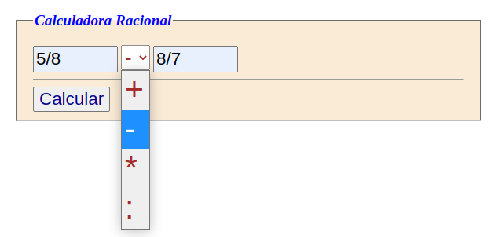

# Calculadora Racional

Se pide que realicemos una aplicación web que resuelva cálculos aritméticos con números fraccionarios del tipo a/b.
La pantalla de inicio tendrá la siguiente forma:



Como vemos tenemos dos cajas de texto, un desplegable y un botón submit para operar
La aplicación implementará los siguientes requisitos

## RF1 Diseño de la interfaz gráfica

Debes de establecer una interfaz gráfica para poder realizar la aplicación, tal cual se muestra en la image

## RF2 Recoger los datos

Si aprieto el botón submit (RF2.1), recojo los 3 datos(RF2.2):

### RF2.1 

Podemos seguir con la idea de intentar separar más el controlador y la vista, es decir, todo el código php lo realizaremos en un fichero php que no tenga nada de hmtl
Esto nos permite también mejorar la legibilidad, de forma que si hemos presionado submit requerimos ese fichero donde se ejecuta todo el código php.
La idea sería hacer algo como esto:

En el fichero index.php escribiríamos

```php
<?php
if (isset($_POST['submit']))
  require "controlador.php";   
?>
```

y en el fichero controlador.php es donde recogeríamos los valores e implementaríamos toda la lógica de la aplicación, generaríamos los valores que luego visualizaremos en el html, pero esto será otro requisito posterior

### RF2.2 

Ahora toca recoger los valores del formulario:
```php
$op1;
$op2;
$operador;
```

Hay que observar que los valores que recojo, en principio son string (siempre el contenido de una caja de texto, cuando lo recojo con $_POST, voy a obtener un valor de tipo string
```php
$op1 = $_POST['op1'];
```
Recordad que para evitar temas de seguridad es mejor recogerlo con filter_input, y si le aplicamos un función de escapar los caracteres especiales como es htmlspecialchar, aún tendremos más seguiridad, por lo que la acción anterior, estará mejor establecida como:
```php
$op1 = htmlspecialchars(filter_input(INPUT_POST, 'op1'));
```

## RF3 Implementar la clase Racional

Los valores que he recogido, aunque son de tipo string, los queremos convertir a un tipo especial que vamos a crear, un objeto de la clase racional
Se tiene que crear una clase que especifique un objeto que tenga numerador, denominador y que sepa sumar, restar, multiplicar y dividir racionales.
Este ejercicio lo hicimos en clase, así que toca recordar y preguntar cualquier duda que tengáis, es muy importante que lo hagáis poco a poco, entendiendo lo que hacéis, no se lo preguntéis al chat openai, mejor con el slack planteemos dudas y resolvamos. En el wiki también hay una clase Racional creada
La idea es

```php
class Racional
{
    private $num;
    private $den;
    public function __construct(int|string $num=1, int $den=1){
    //Implementa el código para obtener a partir de los parámetros un valor
    //para $this->num y otro para $this->den
    //Recueda que los parámetros podrían ser:
    //$numero = new Racional() => crearía 1/1
    //$numero = new Racional(6)=> crearía 6/1
    //$numero = new Racional(5,7)=>crearía 5/7
    //$numero = new Racional("6/5")=>crearía 6/5
    }
}
```

## RF4 Leer la entrada como objetos racionales

Una vez que esté creada la clase, ya podremos convertir los string leídos en la caja de texto a objetos racionales.
Para ello, en el fichero controlador.php:

```php
//Hacemos la autocarga de los ficheros que implementen la especificación de las clases
$carga = fn($clase)=>require "$clase.php";
spl_autoload_register($carga);

//Leemos el string de las cajas de texto
$op1 = htmlspecialchars(filter_input(INPUT_POST, 'op1'));
....

//Convertimos a Racional
$op1 = new Racional($op1);
```
Esto claramente se puede hacer en una sola instrución, pero mejor separarlo para comprenderlo mejor por pasos.

## RF5 Realizar la operación y obtener resultado

Para este requisito hay que implementar dos aspectos:

1. Implementar las operaciones en la clase Racional: que la suma me devuelva otro racional como resultado. por ejemplo el método sumar

    ```php
    public function sumar(Racional $r1):Racional
    {
        $num = $r1->num * $this->den + $r1->den * $this->num;
        $den = $r1->den * $this->den;
        return new Racional ($num, $den);
    }
    ```
2. Ahora hay que utilizarlo cuando corresponda, en el fichero controlador.php:

    ```php
    $operador = htmlspecialchars(filter_input(INPUT_POST, 'operador'));
    
    switch($operador){
        case '+':
        $resultado = $op1->sumar($op2);
        break;
        //.......
    }
    ```

## RF6 implementar el método toString para visualizar los objetos como string

Lo que nos queda es que al intentar visualizar un Racional, o sea convertirlo a string, nos visualice el valor, por ejemplo 8/7
